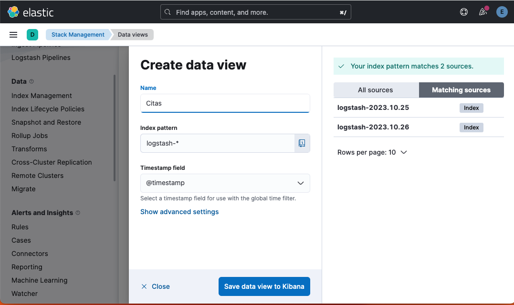
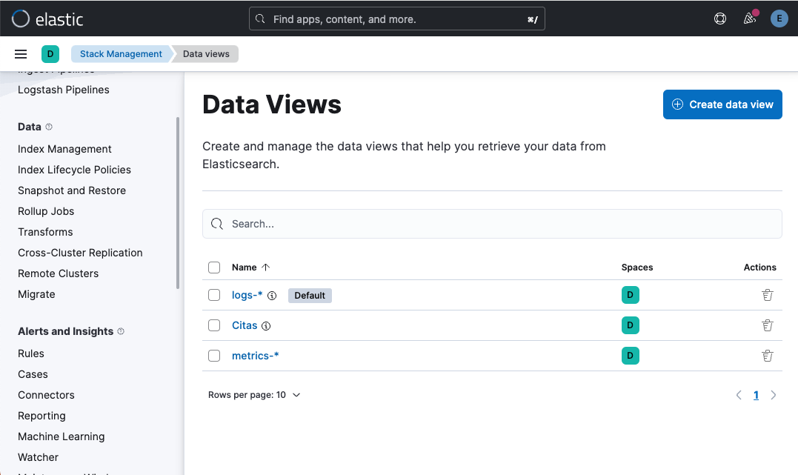
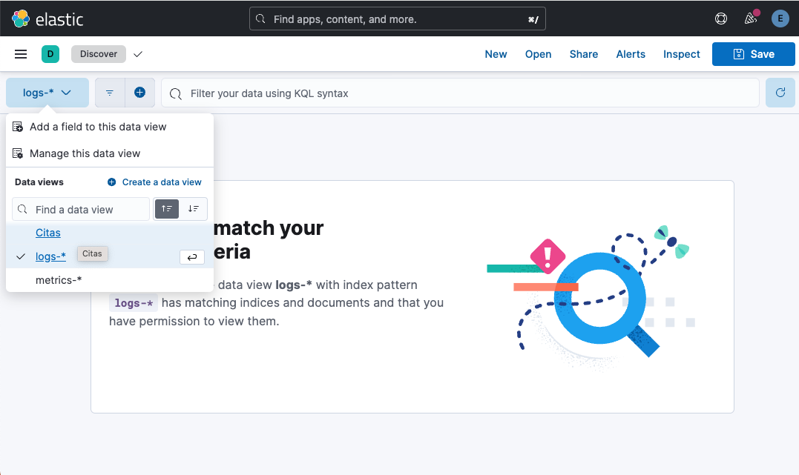
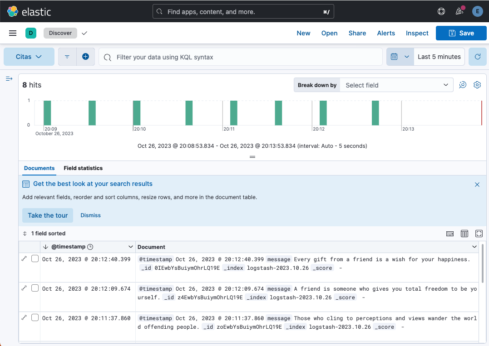

////
NO CAMBIAR!!
Codificación, idioma, tabla de contenidos, tipo de documento
////
:encoding: utf-8
:lang: es
:toc: right
:toc-title: Tabla de contenidos
:doctype: book
:linkattrs:

:figure-caption: Fig.

////
Nombre y título del trabajo
////
# Uso de sidecars en Kubernetes
Cloud Computing - Máster en Tecnologías y Aplicaciones en Ingeniería Informática
Manuel Torres y Francisco José García García <mtorres@ual.es> <paco.garcia@ual.es>

image::images/di.png[]

// NO CAMBIAR!! (Entrar en modo no numerado de apartados)
:numbered!: 

[abstract]
== Resumen

Este tutorial muestra cómo usar sidecars en Kubernetes. Se explica qué son los sidecars y cómo se pueden usar para añadir funcionalidad a un contenedor. A modo de ejemplo se muestra cómo usar un sidecar para añadir un recolector de logs a un contenedor. Para aproximarnos a un caso más real se muestra cómo enviar los logs a un servidor ELK y cómo visualizarlos en Kibana.

.Objetivos

* Aprender qué son los sidecars y cómo se pueden usar en Kubernetes.
* Aprender a usar un sidecar para añadir un recolector de logs a un contenedor.
* Aprender a enviar los logs a un servidor ELK y a visualizarlos en Kibana.

[TIP]
====
Disponible el https://github.com/ualmtorres/sidecar-log-generator.git[repositorio] usado en este tutorial.
====

## Requisitos

Para seguir este tutorial es necesario disponer de un cluster de Kubernetes (puede ser Minikube). También es necesario tener instalado el cliente de Kubernetes `kubectl`.

## Sidecars

Un sidecar es un contenedor que se ejecuta junto a otro contenedor en el mismo pod. Los sidecars se usan para añadir funcionalidad a un contenedor. Así, el enfoque de uso de sidecars en Kubernetes permite a las aplicaciones aprovechar capacidades extra sin modificar su código principal. Esta arquitectura es especialmente útil para mejorar la observabilidad, la seguridad y la administración de las aplicaciones en contenedores.

Como hemos comentado, un sidecar es un contenedor adicional que se ejecuta junto al contenedor principal en un pod de Kubernetes. Los pods son la unidad de despliegue más pequeña en Kubernetes, y normalmente contienen un solo contenedor que ejecuta la aplicación principal. Sin embargo, a veces es necesario adjuntar a la aplicación principal funcionalidades complementarias, como recolección de logs, monitorización, componentes de seguridad, entre otras. En estos casos, se puede usar un sidecar para añadir estas funcionalidades al pod.

En cuanto a la forma de interacción entre el contenedor principal y el sidecar, dado que los sidecars se ejecutan en el mismo pod que el contenedor principal, comparten el mismo espacio de red y el mismo espacio de almacenamiento. Esto permite que los sidecars accedan a los mismos recursos que el contenedor principal. Por ejemplo, un sidecar puede acceder a los logs del contenedor principal, o a los archivos que el contenedor principal almacena en un volumen. Esta extensión de funcionalidades al contenedor principal ofrece ventajas como:

* **Mejora de la observabilidad**: los sidecars pueden recolectar logs y métricas de la aplicación principal, y enviarlos a un sistema de monitorización.
* **Mejora de la seguridad**: los sidecars pueden añadir funcionalidades de seguridad a la aplicación principal, como por ejemplo, un proxy de autenticación.
* **Mejora de la administración**: los sidecars pueden añadir funcionalidades de administración a la aplicación principal, como por ejemplo, un recolector de métricas.
* **Gestión de certificados**: los sidecars pueden gestionar los certificados de la aplicación principal, como por ejemplo, renovarlos automáticamente.
* **Cargas de trabajo específicas**: los sidecars pueden realizar tareas de compresión o cifrado de datos para la aplicación principal.

En cuanto al ciclo de vida y la escalabilidad, los sidecars siguen el mismo ciclo de vida que el contenedor principal. Esto significa que si el contenedor principal se reinicia, el sidecar también se reinicia. Además, si el contenedor principal se escala, el sidecar también se escala. Por ejemplo, si el contenedor principal se escala a 3 réplicas, el sidecar también se escala a 3 réplicas.

## Definición de sidecars en Kubernetes

Para definir un sidecar en Kubernetes, se debe añadir un contenedor adicional al pod que contiene el contenedor principal. Para ello, se debe añadir una nueva entrada en la sección `spec.containers` del manifiesto del pod. Por ejemplo, el siguiente manifiesto de pod contiene un contenedor principal llamado `main-container` y un sidecar llamado `sidecar-container`:

----
apiVersion: v1
kind: Pod
metadata:
  name: sidecar-pod
spec:
    containers:
    - name: main-container
        image: nginx
    - name: sidecar-container
        image: busybox
        command: ['sh', '-c', 'echo Hello from the sidecar container! && sleep 3600']
----

En este ejemplo, el contenedor principal es un contenedor de Nginx, y el sidecar es un contenedor de Busybox. El sidecar ejecuta un comando que imprime un mensaje por pantalla y se queda en espera durante 1 hora. Para crear el pod, se debe ejecutar el siguiente comando:

----
kubectl apply -f sidecar-pod.yaml
----

Una vez creado el pod, se puede comprobar que el pod contiene dos contenedores, el contenedor principal y el sidecar:

----
kubectl get pods sidecar-pod
----

El resultado del comando es el siguiente:

----
NAME          READY   STATUS    RESTARTS   AGE
sidecar-pod   2/2     Running   0          2m
----

Como se puede observar, el pod contiene dos contenedores, el contenedor principal y el sidecar. Además, ambos contenedores están en estado `Running`.

Para ver los logs del sidecar se puede ejecutar el siguiente comando:

----
kubectl logs sidecar-pod -c sidecar-container
----

El resultado del comando es el siguiente:

----
Hello from the sidecar container!
----

## Sidecars para recolección de logs

En este apartado se muestra cómo usar un sidecar para añadir un recolector de logs a un contenedor. Para ello, se va a usar un contenedor de Nginx como contenedor principal, y un contenedor de Busybox como sidecar. El sidecar va a recolectar los logs del contenedor principal y los va a enviar a un servidor de logs.

### Configuración del servidor de logs

Si no se dispone de un servidor de logs a continuación se muestra cómo configurar un servidor de logs ELK (Elasticsearch, Logstash y Kibana) en una servidor aparte. Para facilitar la configuración del servidor de logs realizaremos una instalación con Docker compose. Este https://github.com/deviantony/docker-elk[repositorio GitHub] contiene un fichero `docker-compose.yml` que permite desplegar un servidor de logs ELK así como las instrucciones para desplegarlo. Para desplegar el servidor de logs se debe ejecutar el siguiente comando:

----
git clone https://github.com/deviantony/docker-elk.git
cd docker-elk/
docker compose up setup
docker compose up -d
----

Este despliegue utiliza una configuración básica de ELK y de seguridad. El usuario predeterminado es `elastic` y el password `changeme`. En el mismo repositorio se puede encontrar una configuración más avanzada de ELK y de seguridad.

.Configuración de un servidor de logs con Terraform en OpenStack
****
Terraform es una herramienta de infraestructura como código que permite desplegar infraestructura en la nube. En este apartado se muestra cómo desplegar un servidor de logs ELK en OpenStack usando Terraform. Como considereraciones previas, el OpenStack que se va a utilizar ofece una imagen de Ubuntu 22.04. Además, se debe tener instalado Terraform en el equipo local. El proyecto Terraform para desplegar el servidor de logs se puede encontrar en este https://github.com/ualmtorres/ELK-Terraform.git[repositorio GitHub].

Básicamente el proyecto Terraform cuenta con lo siguiente:

* Un fichero `main.tf` que contiene la configuración de Terraform para desplegar la infraestructura (máquina virtual Ubuntu y una dirección IP flotante asociada a ella).
* Un fichero `variables.tf` que contiene las variables de configuración de Terraform.
* Un fichero `terraform.tfvars` que contiene los valores de las variables de configuración de Terraform.
* Un fichero `install-elk.sh` que contiene el script de configuración del servidor de logs. El script realiza una instalación básica de paquetes, instala Docker, clona el repositorio de Docker ELK, y despliega el servidor de logs.

Para desplegar el servidor de logs se debe ejecutar el siguiente comando:

----
git clone https://github.com/ualmtorres/ELK-Terraform.git
cd ELK-Terraform/
terraform init
terraform apply
----

Tras el despliegue contaremos con un Elasticsearch y un Kibana disponible en la dirección IP flotante asignada a la máquina virtual. El servidor Elasticsearch estará disponible en el puerto 9200, y el servidor Kibana en el puerto 5601. Para acceder a ambos, como hemos comentado usaremos una configuración básica y se debe introducir el usuario `elastic` y el password `changeme`.
****

### Acerca del generador de logs

Para configurar generador de logs se va a usar un contenedor de Busybox. El generador de logs implementa un bucle que realiza llamadas cada 30 segundos a una API REST que obtiene frases célebres aleatorias de la web https://api.quotable.io/random. La entrada de log que se generará incluirá el contenido de la frase junto con su autor. El código del generador de logs sería algo así:

----
#!/bin/sh
while true
do
    curl -s https://api.quotable.io/random | jq -r '.content + " - " + .author' >> /var/log/quotes.log
    sleep 30
done
----

Dado que el generador de logs realiza llamadas `curl` para las llamadas a una API REST, usaremos una imagen Busybox que incorpore `curl` como la de https://hub.docker.com/r/yauritux/busybox-curl[yaritux/busybox-curl]. 

Este contenedor escribirá sus logs en un archivo (`app.logs`) que se encuentra en el directorio `/var/log` del contenedor. Para que el sidecar pueda acceder a los logs del contenedor principal, se debe montar el directorio `/var/log` del contenedor principal en el directorio `/var/log` del sidecar. Para ello, se debe añadir una entrada en la sección `spec.volumes` del manifiesto del pod. Más adelante, cuando definamos el manifiesto del pod, se mostrará cómo hacerlo.

### Acerca del sidecar

Para configurar el sidecar se va a usar un contenedor que recolecta los logs y los envía al servidor ELK que tenemos configurado. Los logs los recolecta de un volumen que se monta en el directorio `/var/log` del sidecar. Este volumen es el mismo que se monta en el directorio `/var/log` del contenedor principal y que éste utiliza para escribir los logs. Para enviar los logs al servidor ELK, el sidecar usa un agente de Fluentd. 

[NOTE]
====
Fluentd es un recolector de logs que permite recolectar logs de múltiples fuentes y enviarlos a múltiples destinos. Más información en https://www.fluentd.org/[https://www.fluentd.org/].
====

En este caso, el agente de Fluentd se va a configurar para recolectar los logs del contenedor principal y enviarlos al servidor ELK. Para ello, se debe configurar el agente de Fluentd para que recolecte los logs del contenedor principal y los envíe al servidor ELK. Para ello, se debe añadir una entrada en la sección `spec.containers` del manifiesto del pod. Más adelante, cuando definamos el manifiesto del pod, se mostrará cómo hacerlo.

Fluentd se configura mediante un fichero de configuración. Este archivo de configuración contiene la configuración de las fuentes de logs (en nuestro caso un archivo `/var/log/app.log`) y de los destinos de logs (en nuestro caso un servidor ELK). El fichero de configuración (`fluentd.conf`) se va a montar en el directorio `/fluentd/etc` del contenedor. Para ello, se debe añadir una entrada en la sección `spec.volumes` del manifiesto del pod. La configuración del archivo `fluentd.conf` se inyectará mediante un ConfigMap. Más adelante, cuando definamos el manifiesto del pod, se mostrará cómo hacerlo.

.Contenido del fichero `fluentd.conf`
----
# First log source (tailing a file at /var/log/app.log)
<source>
    @type tail
    format none
    path /var/log/app.log
    pos_file /var/log/app.log.pos
    tag count.format1
</source>

<match **>
    @type elasticsearch
    host xxx.xxx.xxx.xxx    <1>
    port 9200
    user the-user-here      <2>
    password the-password-here <3>
    logstash_format true
</match>
----
<1> Dirección IP del servidor ELK
<2> Usuario de acceso al servidor ELK
<3> Password de acceso al servidor ELK

### Definición del ConfigMap

Usaremos un ConfigMap para inyectar la configuración del agente de Fluentd en el sidecar. La configuración contiene credenciales de acceso al servidor ELK y está almacenada en un fichero `fluentd.conf`. Para crear el Secret se debe ejecutar el siguiente comando:

----
kubectl create configmap fluentd-conf-configmap \
    --from-file=fluentd-conf=./fluentd.conf
----

Este comando crea un _configmap_ denominado `fluentd-conf-configmap` a partir del fichero `fluentd.conf`. La configuración se vuelca en una clave denominada `fluentd-conf`. Para ver el contenido del configmap se puede ejecutar el siguiente comando:

Para ver el contenido del configmap se puede ejecutar el siguiente comando:

----
kubectl get configmap fluentd-conf-configmap -o yaml
----

### Definición del pod

Para definir el pod se debe crear un fichero `multi-container-pod.yaml` con el siguiente contenido:

----
apiVersion: v1
kind: Pod
metadata:
  name: multi-container-pod
spec:
  containers:
  - name: cite-generator
    image: yauritux/busybox-curl
    command: ["/bin/sh", "-c"]
    args:
    - >
      while true;
      do
        # Write two log files along with the date and a counter
        # every second
        # echo "$i: $(date)" >> /var/log/1.log;
        frase=$(curl -s https://api.quotable.io/random)
        echo $frase | grep -o '"content":"[^"]*' | grep -o '[^"]*$'  >> /var/log/app.log;
        sleep 30;
      done
    # Mount the log directory /var/log using a volume
    volumeMounts:
    - name: varlog
      mountPath: /var/log
  - name: fluentd
    image: fluent/fluentd-kubernetes-daemonset:v1-debian-elasticsearch
    env:
      - name:  FLUENT_ELASTICSEARCH_HOST
        value: "xxx.xxx.xxx.xxx" <1>
      - name:  FLUENT_ELASTICSEARCH_PORT
        value: "9200"
      - name: FLUENT_ELASTICSEARCH_SCHEME
        value: "http"
      - name: FLUENT_ELASTICSEARCH_USER
        value: "your-user-here" <2>
      - name: FLUENT_ELASTICSEARCH_PASSWORD
        value: "your-password-here" <3>
      - name: FLUENT_UID
        value: "0"
    # Mount the log directory /var/log using a volume
    # and the config file
    volumeMounts:
    - name: varlog
      mountPath: /var/log
    - name: config-volume
      mountPath: /fluentd/etc
  # Declare volumes for log directory and ConfigMap
  volumes:
  - name: varlog
    emptyDir: {}
  - name: config-volume
    configMap:
      name: fluentd-config
----
<1> Dirección IP del servidor ELK
<2> Usuario de acceso al servidor ELK
<3> Password de acceso al servidor ELK

Una vez creado el fichero, se puede crear el pod ejecutando el siguiente comando:

----
kubectl apply -f multi-container-pod.yaml
----

Una vez creado el pod, se puede comprobar que el pod contiene dos contenedores, el contenedor principal y el sidecar:

----
kubectl get pods multi-container-pod
----

El resultado del comando es el siguiente:

----
NAME                  READY   STATUS    RESTARTS   AGE
multi-container-pod   2/2     Running   0          2m
----

Como se puede observar, el pod contiene dos contenedores, el contenedor principal y el sidecar. Además, ambos contenedores están en estado `Running`.

### Comprobación del funcionamiento

Tras este despliegue, el generador de logs `cite-generator` comenzará a generar logs y el sidecar `fluentd` los enviará al servidor ELK. 

Para comprobar que está generando logs se puede lanzar un comando contra el contenedor principal para ver los logs que está generando. Para ello, mostraremos el contenido del archivo `/var/log/app.log` y lo haremos ejecutando el siguiente comando:

----
kubectl exec -t multi-container-pod --container cite-generator -- cat /var/log/app.log
----

Para ver que los logs se están enviando al servidor ELK, se puede acceder al servidor Kibana. Para ello, se debe acceder a la dirección IP flotante del servidor Kibana en el puerto 5601.

#### Creación de una vista de datos en Kibana

Para poder visualizar los logs en Kibana, se debe crear una vista de datos. Las vistas de datos se corresponden con el anterior concepto de _index pattern_. Para crear una vista de datos se debe acceder a la sección `Management` y seleccionar la opción `Stack Mananagment`. A continuación, en la sección `Kibana` seleccionaremos `Data Views` y pulsaremos el botón `Create data view`. En el campo `Name` introduciremos `Citas`, en `Index pattern` introduciremos `logstash-*` y en `Timestamp field` dejaremos `@timestamp`. Para terminar pulsaremos el botón `Save data view to Kibana`. En el campo `Time Filter field name` seleccionaremos `@timestamp` y pulsaremos el botón `Create index pattern`.

Esto nos mostrará la definición de la vista de datos. En la sección `Kibana` podemos ver la vista de datos creada junto al resto de vistas de datos.

#### Visualización de los logs en Kibana

Para visualizar los logs en Kibana, en el menú principal, sección `Analytics` seleccionaremos `Discover`. En el desplegable `Data view` aparecerá `Citas`, tal y como muestra la figura.

Tras seleccionar un rango de fechas, se mostrarán los logs generados por el generador de logs.

// Entrar en modo numerado de apartados
:numbered:

## Conclusiones

En este tutorial se ha mostrado cómo usar sidecars en Kubernetes. Se ha explicado qué son los sidecars y cómo se pueden usar para añadir funcionalidad a un contenedor. Los sidecars proporcionar una forma limpia de extender la funcionalidad de un contenedor sin modificar el código de la aplicación. Para ilustrar su funcionamiento se ha mostrado cómo usar un sidecar para añadir un recolector de logs a un contenedor. Además, se ha mostrado cómo enviar los logs a un servidor ELK y cómo visualizarlos en Kibana.

:numbered!: 

## Enlaces de interés

* https://[]
* https://www.youtube.com/playlist?list=PLoS04oY1FHPNdxLM1PM5_FqhwZqyD_AMQ[Lista
de reproducción YouTube].
